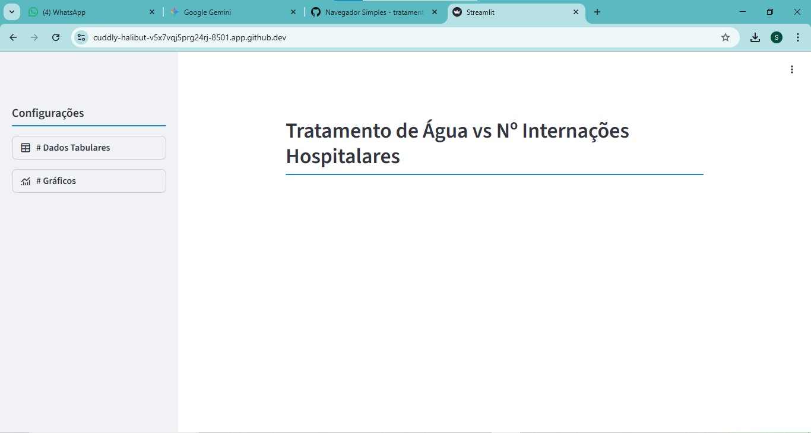
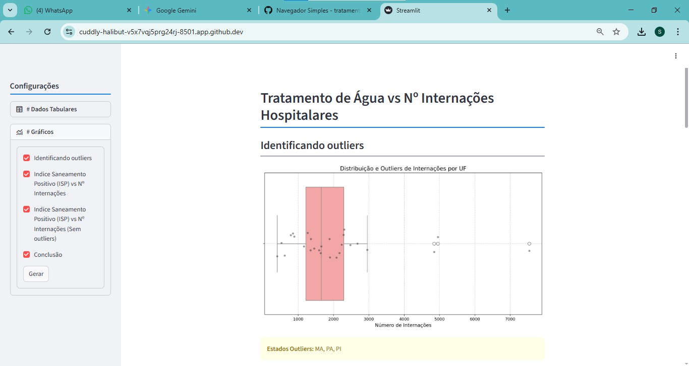
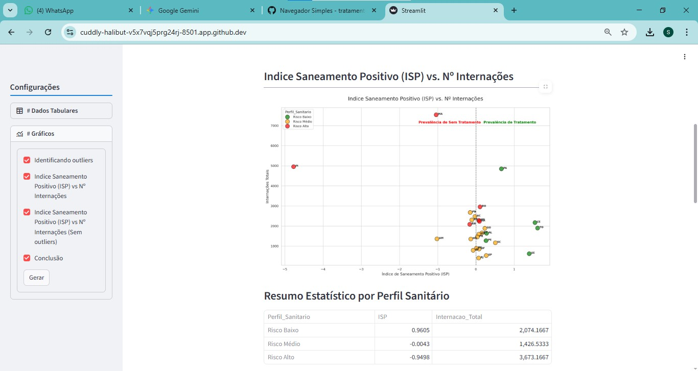
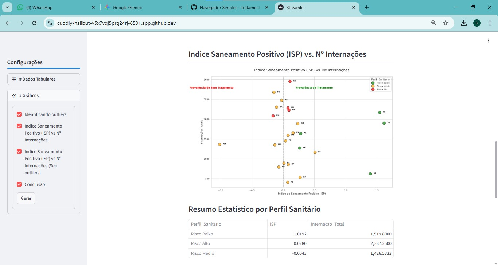
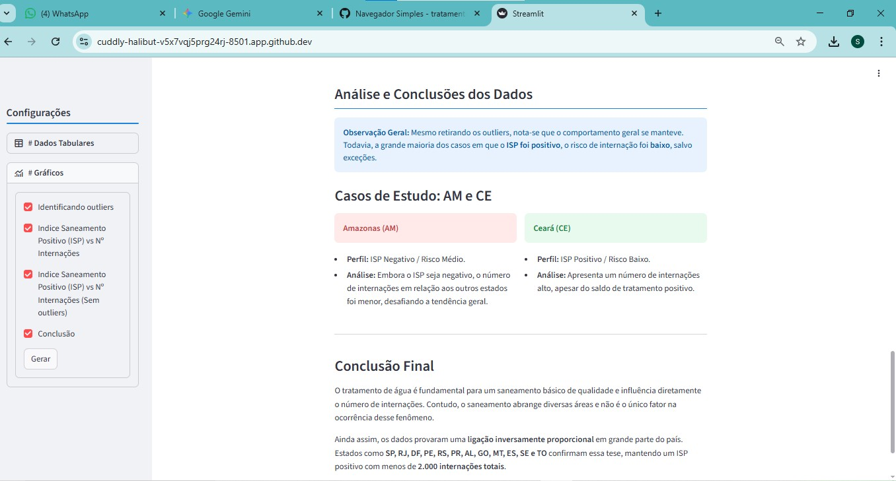

# Análise de Saneamento: Tratamento de Água vs. Internações (Brasil)

Este projeto realiza uma análise de dados integrando estatísticas de tratamento de água por municípios (IBGE) e dados de internações hospitalares por doenças relacionadas ao saneamento básico. O objetivo é identificar padrões, correlações e agrupamentos de risco entre os estados brasileiros utilizando técnicas de Ciência de Dados e Machine Learning.

---

## 📊 Visão Geral
O projeto processa dados brutos do IBGE, realiza a limpeza de caracteres específicos da fonte original e unifica as bases por Unidade Federativa (UF). Através de algoritmos de **K-Means**, os estados são agrupados em perfis de risco para melhor compreensão do impacto do tratamento de água na saúde pública.

## 🛠️ Tecnologias Utilizadas
* **Python 3.x**
* **Pandas & NumPy**: Manipulação e tratamento de dados.
* **Matplotlib & Seaborn**: Visualização de dados e plotagem de gráficos estatísticos.
* **Scikit-Learn**: Normalização de dados (`StandardScaler`) e Clusterização (`K-Means`).

## 🚀 Principais Etapas do Projeto
1. **Tratamento de Dados IBGE**: Implementação de funções para limpar símbolos específicos (como `-`, `...`, `X`) e converter strings para formato numérico *float*.
2. **Engenharia de Dados**: Extração de UFs a partir de nomes de municípios e agregação de volumes de tratamento por estado.
3. **Normalização e Clusterização**: Aplicação de escala nos dados para agrupar estados com comportamentos similares de saneamento e internação.
4. **Análise Comparativa**: Estudo detalhado de discrepâncias regionais e *outliers*.

## 🖥️ Visualização da Interface (Streamlit)

O dashboard foi desenvolvido para proporcionar uma experiência interativa, permitindo que o usuário navegue entre os dados brutos e as análises estatísticas avançadas.

| **Página Inicial** |


 
| **Identificação de estados atípicos (Boxplot)** |



| **Indíce de Sanemanto Positivo (ISP) vs Nº Internações (Com outliers)** 



| **Indíce de Sanemanto Positivo (ISP) vs Nº Internações (Sem outliers)** |



| **Análise e conclusão** |



---

## 📈 Conclusões da Análise
A partir dos dados observados:
* **Correlação Inversamente Proporcional**: Estados como **SP, RJ, DF, PE, RS e PR** apresentaram um Índice de Saneamento Positivo (ISP) correlacionado a um número baixo de internações (menos de 2.000 casos totais).
* **Exceções e Complexidade**:
    * **Amazonas (AM)**: Apresentou ISP negativo, mas um volume de internações relativamente menor que outros estados, sendo agrupado como risco médio.
    * **Ceará (CE)**: Apesar de um ISP positivo e agrupamento de baixo risco, mantém um número alto de internações.
* **Fator Saneamento**: Os dados provam que o tratamento de água é fundamental para a redução de doenças, embora não seja o único fator preponderante, dado que o saneamento abrange outras áreas complexas (esgoto, coleta de lixo, etc).

## 📂 Como Executar

No Google Colab
1. Acompanhe todo processo de 'data science' incluindo a junção dos dataframes e análises executando o notebook fornecido 'projeto_final'

No CodeSpace (Streamlit)
1. Clone o repositório.
2. Certifique-se de ter os arquivos de dados (ex: `ret_tratamento_tabela1773.xlsx`) no diretório raiz.
3. Instale as dependências: 
   ```bash
   pip install pandas scikit-learn matplotlib seaborn
4. Execute no terminal: streamlit run app.py

---
**Autor** Sander Gustavo Piva
